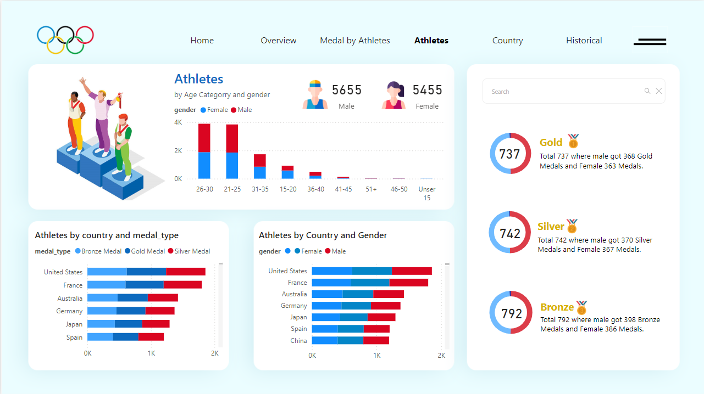

# Paris-Olympics-2024-Analysis-
Comprehensive Power BI Dashboard for Analyzing the 2024 Paris Olympics
| Title | Description |
| --- | --- |
| **Overview of Medal Distribution** |   *This page offers an overview of medal distribution across countries and sports disciplines. Users can apply filters by country to see detailed medal tallies and corresponding event statistics..*|
| **Medal by Athletes** |   *Breakdown of athlete performance by country and gender. It provides insights into the number of medals won, gender distribution, and maps showcasing country-specific results.*|
| **Athlete Insights** |  *Explore athlete demographics and performance data, including age group analysis, gender distribution, and medal counts categorized by country and discipline.* |
